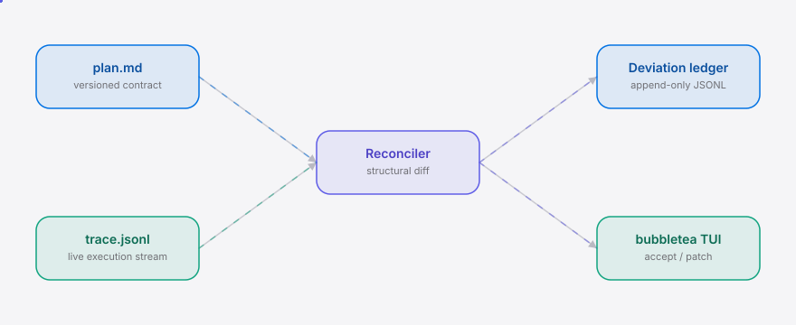

<div align="right"><sub><b>EN</b>&nbsp;&nbsp;⇄&nbsp;&nbsp;<a href="./README.zh-CN.md">中文</a></sub></div>

<picture>
  <source media="(prefers-color-scheme: dark)" srcset="./assets/hero-dark.svg">
  <source media="(prefers-color-scheme: light)" srcset="./assets/hero-light.svg">
  
</picture>

<p align="center"><sub>The plan-execution-deviation-ledger for long-horizon coding/research agents.</sub></p>

<p align="center">
  <a href="./LICENSE"></a>
  <a href="https://github.com/SuperMarioYL/driftledger/releases"></a>
  <a href="https://github.com/SuperMarioYL/driftledger/actions/workflows/ci.yml"></a>
  
  
</p>

**Your agent stated a plan at minute 0, drifted from it at minute 20 — you only found out at minute 88. DriftLedger surfaces the drift the instant it happens, next to your coding agent, with an accept control.**

DriftLedger is the in-flight sequel to the loop-engineering discipline that Addy Osmani and Boris Cherny helped name — the closest thing to [cobusgreyling/loop-engineering](https://github.com/cobusgreyling/loop-engineering) built for live reconciliation, where `loop-audit` reports drift at minute 88 and DriftLedger shows it at minute 20. You publish your agent's plan as a versioned contract; DriftLedger reconciles the live trace against it on every new line and renders the deviation ledger in a bubbletea TUI with `a`-to-accept. Free, OSS, single binary, no account.

<details>
<summary>Table of contents</summary>

- [Architecture](#architecture)
- [Why this exists](#why-this-exists)
- [Install](#install)
- [Quickstart](#quickstart)
- [Usage](#usage)
- [Demo](#demo)
- [Configuration](#configuration)
- [Roadmap](#roadmap)
- [License](#license)
</details>

<h2> Architecture</h2>

<picture>
  <source media="(prefers-color-scheme: dark)" srcset="./assets/atlas-dark.svg">
  <source media="(prefers-color-scheme: light)" srcset="./assets/atlas-light.svg">
  
</picture>

One Go binary, one process, no daemons, no network. The Reconciler runs on every new trace line and re-emits the deviation set; the ledger is an append-only JSONL file (`./driftledger.ledger.jsonl`) any `jq` can inspect. Reconciliation is **structural** — step-presence plus accept-criteria keyword match — not an LLM judgment, so it's deterministic and cheap enough to run per trace line.

## Why this exists

Long-horizon coding and research agents now run for minutes to hours, and during that run they silently drift from the plan they started with — reinterpreting scope, swapping tools, chasing tangents. You only discover the drift post-mortem, when the agent has already burned hours and produced off-target output. DriftLedger binds the published plan to the running agent's live execution and lets you accept the drift mid-flight, turning a post-mortem discovery into a first-class, versioned record.

<h2> Install</h2>

```bash
go install github.com/SuperMarioYL/driftledger@latest
```

Or build from source:

```bash
git clone https://github.com/SuperMarioYL/driftledger
cd driftledger && go build -o driftledger ./cmd/driftledger
```

<h2> Quickstart</h2>

Three commands from cold clone to first visible drift:

```bash
driftledger init -p plan.md                      # scaffold a 3-step versioned contract
# ...your agent runs, a shim appends trace.jsonl...
driftledger watch plan.md trace.jsonl            # live deviation ledger; press `a` to accept
```

<details>
<summary>sample <code>diff</code> output</summary>

```
$ driftledger diff plan.md trace.jsonl
plan 0.1.0  3 steps  3 trace events
------
step-1       matched     first-seen:2026-07-23T10:00:00Z
step-2       drifting    first-seen:2026-07-23T10:20:00Z  unmet: matched; drifting; unexecuted
step-3       unexecuted  first-seen:—
side-quest   extra       first-seen:2026-07-23T10:20:30Z  summary: rewrote the README hero instead
------
matched:1  drifting:1  unexecuted:1  extra:1
```
</details>

<h2> Usage</h2>

```bash
# Scaffold an example plan contract (versioned, 3 steps, accept criteria as keywords).
driftledger init -p plan.md

# Print plan-vs-trace deviations to stdout (non-interactive; overlays accepted state
# from the ledger). Use this in CI or to script drift checks.
driftledger diff plan.md trace.jsonl

# Render the live deviation ledger in a TUI. Tails trace.jsonl, re-reconciles on
# every new line, and lets you press `a` to accept a drift mid-flight.
driftledger watch plan.md trace.jsonl

# patch rewrites the contract to a new version folding accepted deviations;
# rollback emits a git-revert + checkpoint-tag directive (never executes it).
# v0.2.0 ships patch; v0.3.0 ships rollback — the loop is closed.
driftledger patch plan.md
driftledger rollback plan.md
```

**Plan contract (`plan.md`)** — markdown, one `## <step-id>` heading per step:

```markdown
# Plan: demo run

version: 0.1.0

## step-1
intent: Scaffold the project structure
accept: go module
accept: cmd package

## step-2
intent: Implement the structural reconciler
accept: matched
accept: drifting
accept: unexecuted
```

**Trace (`trace.jsonl`)** — one JSON object per line, appended live by a thin shim around your agent's commands:

```json
{"ts":"2026-07-23T10:00:00Z","step_id":"step-1","action":"run","summary":"initialized go module and added cmd package"}
```

Each accept criterion is matched when its keywords (whole words, ≥3 chars, stopwords dropped) all appear in the step's trace summaries. Phrase criteria as the nouns/verbs that must show up when the step is done.

<h2> Demo</h2>


The 10-minute happy path: `init` a 3-step plan, simulate an agent abandoning step-3 for a README tangent at minute 20, and `diff` surfaces the drift the instant it happens. The same reconciliation renders live in `watch` with `a`-to-accept. A recorded asciinema cast lives at `assets/demo.cast`.

<h2> Configuration</h2>

DriftLedger is config-file-free — everything is a CLI flag. The two file inputs plus the ledger path:

| Input | Path / flag | Format | Meaning |
|---|---|---|---|
| Plan contract | `plan.md` (positional) | markdown | The versioned steps the agent promises to run; `version:` + `## <id>` + `intent:` + `accept:` lines. |
| Trace stream | `trace.jsonl` (positional) | JSONL | One event per line: `ts`, optional `step_id`, `action`, `summary`. |
| Deviation ledger | `--ledger driftledger.ledger.jsonl` | JSONL | Append-only audit trail; `accept`/`patch`/`rollback` entries, `jq`-inspectable. |

<h2> Roadmap</h2>

- [x] **m1 — reconcile + live TUI**: `diff` prints deviations to stdout; `watch` renders the live deviation ledger in a bubbletea TUI with `a`-to-accept. The one-weekend, star-earning slice.
- [x] **m2 — patch the contract**: `patch` rewrites `plan.md` to a new semantic version capturing accepted deviations; the ledger becomes a versioned audit trail. *(shipped v0.2.0)*
- [x] **m3 — emit rollback directive**: `rollback` emits a `git revert` + checkpoint-tag directive for accepted deviations (we emit, never execute). Ships with the asciinema cast for the HN launch. *(shipped v0.3.0)*
- [ ] Trace shims for Claude Code / deer-flow transcripts; LLM-graded semantic diff as an opt-in mode; alerting on drift thresholds.

### vs the closest adjacent tool

| Feature | DriftLedger | [loop-engineering](https://github.com/cobusgreyling/loop-engineering) |
|---|---|---|
| Live in-flight reconciliation | ✓ | — |
| Plan-as-versioned-contract | ✓ | — |
| Post-hoc loop audit (cost / init) | — | ✓ |
| Append-only jq-inspectable ledger | ✓ | partial |
| Single binary, zero deps | ✓ | ✓ |
| Established community (8.9k★) | — | ✓ |

Honest: loop-engineering owns the after-the-fact audit and the audience; DriftLedger only earns its keep where you want drift surfaced and accepted *while the agent is still running*.

<h2> License</h2>

MIT — see [LICENSE](./LICENSE). File issues and PRs at [github.com/SuperMarioYL/driftledger](https://github.com/SuperMarioYL/driftledger/issues).

## Share this

```
DriftLedger — the plan-execution-deviation-ledger for long-horizon Agent runs. loop-audit shows drift at minute 88; DriftLedger shows it at 20 and lets you accept mid-flight. https://github.com/SuperMarioYL/driftledger
```

<p align="center"><sub><a href="./LICENSE">MIT</a> © 2026 SuperMarioYL</sub></p>
