[English](README.md) | **简体中文**

<picture>
  <source media="(max-width: 640px) and (prefers-color-scheme: dark)" srcset="assets/presentation/hero-mobile-dark.svg">
  <source media="(max-width: 640px)" srcset="assets/presentation/hero-mobile-light.svg">
  <source media="(prefers-color-scheme: dark)" srcset="assets/presentation/hero-dark.svg">
  
</picture>

**DriftLedger 对照 Markdown 计划与 JSONL 执行记录，列出匹配、偏离、未执行和额外步骤，并保存人工接受与计划修订的记录。**

`Go 1.24+` · [MIT](LICENSE) · [GitHub](https://github.com/SuperMarioYL/driftledger) · [网站](https://driftledger.lei6393.com)

## 为什么需要它

计划和实际执行常保存在不同地方，检查时容易只看到最终产物。把步骤 ID 与验收关键词一起对照，可以先发现哪些承诺没有在记录中出现，再由作者判断偏离是否合理。匹配来自结构规则，不是对完成质量的模型评判。

<picture>
  <source media="(max-width: 640px) and (prefers-color-scheme: dark)" srcset="assets/presentation/process-mobile-dark.svg">
  <source media="(max-width: 640px)" srcset="assets/presentation/process-mobile-light.svg">
  <source media="(prefers-color-scheme: dark)" srcset="assets/presentation/process-dark.svg">
  
</picture>

## 架构

plan 解析版本、步骤和 accept 行，trace 读取带时间戳的事件。Reconcile 按步骤归组并比较摘要关键词，ledger 再叠加人工接受状态。diff 输出文本或 JSON；watch 用 TUI 展示并接受偏离；patch 改写计划版本；rollback 只输出待人工处理的 Git 指令。

<picture>
  <source media="(max-width: 640px) and (prefers-color-scheme: dark)" srcset="assets/presentation/architecture-mobile-dark.svg">
  <source media="(max-width: 640px)" srcset="assets/presentation/architecture-mobile-light.svg">
  <source media="(prefers-color-scheme: dark)" srcset="assets/presentation/architecture-dark.svg">
  
</picture>

## 安装

需要 Go 1.24+。首次构建可能下载依赖；对照过程不调用模型或网络服务。

```bash
git clone https://github.com/SuperMarioYL/driftledger.git
cd driftledger
go build -o driftledger ./cmd/driftledger
```

## 快速开始

```bash
bash docs/demo.sh
```

仓库提供三步计划、三条固定时间的构造 trace 和空 ledger。JSON 返回四行：parse 为 matched；report 缺少 report json 标准，为 drifting；verify 为 unexecuted；extra 为计划外动作。命令不修改计划或 Git 历史。

## 用法

```bash
./driftledger diff examples/presentation-plan.md examples/presentation-trace.jsonl --ledger examples/presentation-empty-ledger.jsonl
./driftledger diff examples/presentation-plan.md examples/presentation-trace.jsonl --json --fail-on-drift
./driftledger watch plan.md trace.jsonl
./driftledger log --json
```

watch 的 a 键记录接受状态。审查后可运行 patch plan.md 把待处理接受项折入新版本；该命令会写计划和 ledger。rollback plan.md 输出带占位 commit-sha 的注释指令并记账，不执行 git revert，也不自动确定正确提交。

## 能力与集成

| 接口 | 契约 |
|---|---|
| Plan | version、## step-id、intent、accept 行 |
| Trace | 每行 ts、step_id、action、summary |
| Ledger | 追加的 accept/patch/rollback JSONL |
| diff --json | 机器可读偏离列表 |
| --fail-on-drift | 未接受的 drifting/unexecuted/extra 返回非零 |
| trace-shim.sh | 在调用方命令周围追加事件，需自行接入 |

<picture>
  <source media="(max-width: 640px) and (prefers-color-scheme: dark)" srcset="assets/presentation/integrations-mobile-dark.svg">
  <source media="(max-width: 640px)" srcset="assets/presentation/integrations-mobile-light.svg">
  <source media="(prefers-color-scheme: dark)" srcset="assets/presentation/integrations-dark.svg">
  
</picture>

## 配置与边界

默认 ledger 为当前目录的 driftledger.ledger.jsonl，可用 --ledger 修改。重复步骤 ID 会被拒绝；未提供 step_id 的事件归为 extra。坏 trace 行会跳过并发出警告，部分输入的结果应谨慎复核。

accept 比较 ASCII 字母、数字、连字符和下划线组成的词，忽略短于 3 字符的词及停用词。它不理解语义或否定；纯中文标准可能没有有效关键词，并在步骤存在时自动满足。应使用可机检的有效关键词，并独立验证实际产物。

## 运行记录

v0.8.0 的实际结构对照输出。输入是构造记录，不是一次真实 Agent 执行或实际工具动作的证明。

[输入、命令和完整输出](docs/demo-results.json)

[保留的历史终端录屏](assets/demo.gif) · [录制脚本](docs/demo.tape)。本轮示例以以上可重放记录为准。

## 路线图

- [x] 计划/trace 解析及四类结构偏离。
- [x] 文本/JSON、TUI 接受、ledger 日志查看。
- [x] patch 版本修订及 rollback 指令记录。
- [ ] 更多 Agent 原生 trace 接入。
- [ ] 可选语义评判和告警集成。

未提供自动 Git 回滚或对计划完成质量的保证。

## 开发与许可证

```bash
go test ./...
```

规则见 [reconcile.go](internal/diff/reconcile.go)，数据格式见 internal/plan 与 internal/trace。

[MIT](LICENSE) · [Issues](https://github.com/SuperMarioYL/driftledger/issues)
